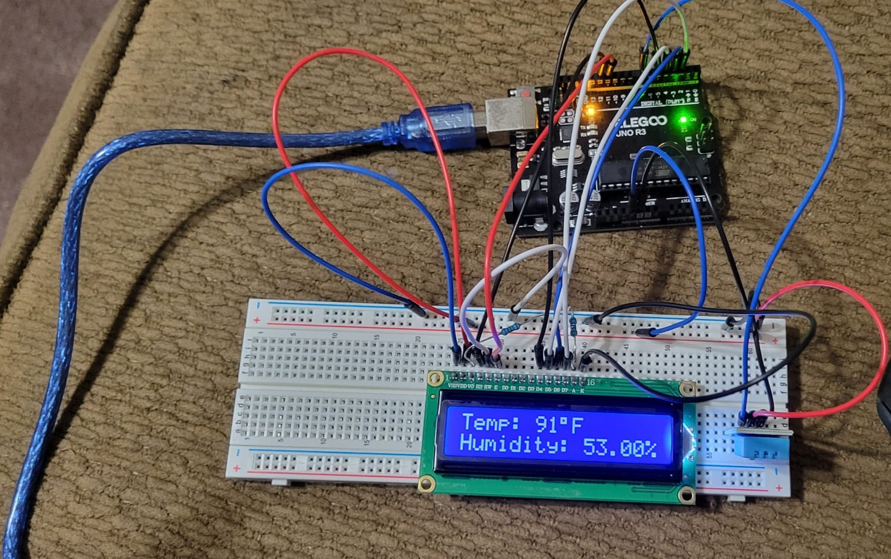

# DHT-11 Temperature and Humidity Sensor

This is a temperature and humidity sensor made using the DHT-11 module, Elegoo Uno R3 microcontroller (Arduino Uno replica), and LCD screen on a breadboard

It is coded in Arduino IDE. 

The delay() command determines how often the program will loop and record data in milliseconds. delay(2000) means it will record every 2 seconds.

## Image of LCD screen with reading

